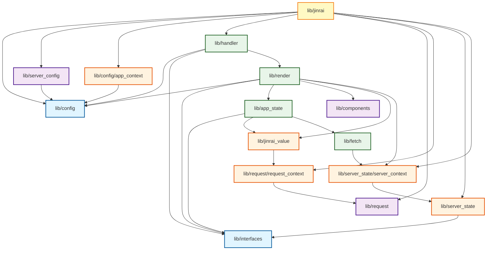

# Список пакетов из папки pkg

Пакеты отсортированы по уровням зависимостей, где `config` находится на самом базовом уровне.

## Граф зависимостей

## Уровень 0 (Базовый уровень)

### `lib/config`
Базовый пакет конфигурации приложения.
- `app.go` - структура App
- `route.go` - структура Route
- `types.go` - типы Server, Content, JsonConfig

### `lib/interfaces`
Интерфейсы для работы с состояниями.
- `state.go` - интерфейсы State и States

## Уровень 1

### `lib/components`
Компоненты приложения (не зависит от других пакетов проекта).
- `component.go` - регистрация и получение компонентов

### `lib/request`
Работа с HTTP запросами (не зависит от других пакетов проекта).
- `scope.go` - структура Scope для работы с URL

### `lib/server_config`
Конфигурация сервера.
- `config.go` - загрузка конфигурации из файла
- Зависит от: `lib/config`

## Уровень 2

### `lib/config/app_context`
Контекст приложения для работы с конфигурацией.
- `app_context.go` - функции для работы с JsonConfig и Server в контексте
- Зависит от: `lib/config`

### `lib/request/request_context`
Контекст запроса.
- `context.go` - функции для работы с Scope в контексте
- Зависит от: `lib/request`

### `lib/server_state`
Состояние сервера.
- `server_state.go` - структура State для управления состоянием сервера
- Зависит от: `lib/interfaces`

### `lib/server_state/server_context`
Контекст состояния сервера.
- `context.go` - функции для работы с State в контексте
- Зависит от: `lib/server_state`

### `lib/jinrai_value`
Работа со значениями Jinrai.
- `jv_type.go` - тип JV
- `convert.go` - парсинг и конвертация значений
- `get_value.go` - получение значений различных типов
- Зависит от: `lib/request/request_context`

## Уровень 3

### `lib/fetch`
Отправка HTTP запросов.
- `send_request.go` - отправка запросов с учетом прокси
- Зависит от: `lib/server_state/server_context`

### `lib/app_state`
Состояние приложения.
- `app_state_type.go` - типы для состояния приложения
- `current_key.go` - получение текущего ключа
- `get_value.go` - получение значения состояния
- Зависит от: `lib/interfaces`, `lib/jinrai_value`, `lib/fetch`

### `lib/render`
Рендеринг контента.
- `findTemplate.go` - поиск шаблона по маршруту
- `getHtml.go` - генерация HTML из контента
- `getValueByPath.go` - получение значения по пути
- `mapByKeys.go` - маппинг по ключам
- Зависит от: `lib/config`, `lib/interfaces`, `lib/app_state`, `lib/components`, `lib/jinrai_value`, `lib/server_state/server_context`

### `lib/handler`
Обработчики запросов.
- `hander.go` - функции для рендеринга и поиска шаблонов
- Зависит от: `lib/config`, `lib/interfaces`, `lib/render`

## Уровень 4

### `lib/jinrai`
Основной пакет Jinrai.
- `jinrai.go` - структура Jinrai и основные методы
- `handler.go` - HTTP обработчик запросов
- `serve.go` - запуск HTTP сервера
- `log.go` - логирование
- Зависит от: `lib/config`, `lib/server_config`, `lib/config/app_context`, `lib/handler`, `lib/request`, `lib/request/request_context`, `lib/server_state`, `lib/server_state/server_context`

## Дополнительные пакеты

### `----jinrai/context`
Контекст для старой версии Jinrai.
- `context.go` - структура Context и методы работы с контекстом
- `html.go` - генерация HTML

### `----jinrai/jsonConfig`
Конфигурация JSON для старой версии Jinrai.
- `renderIndex.go` - рендеринг index.html

